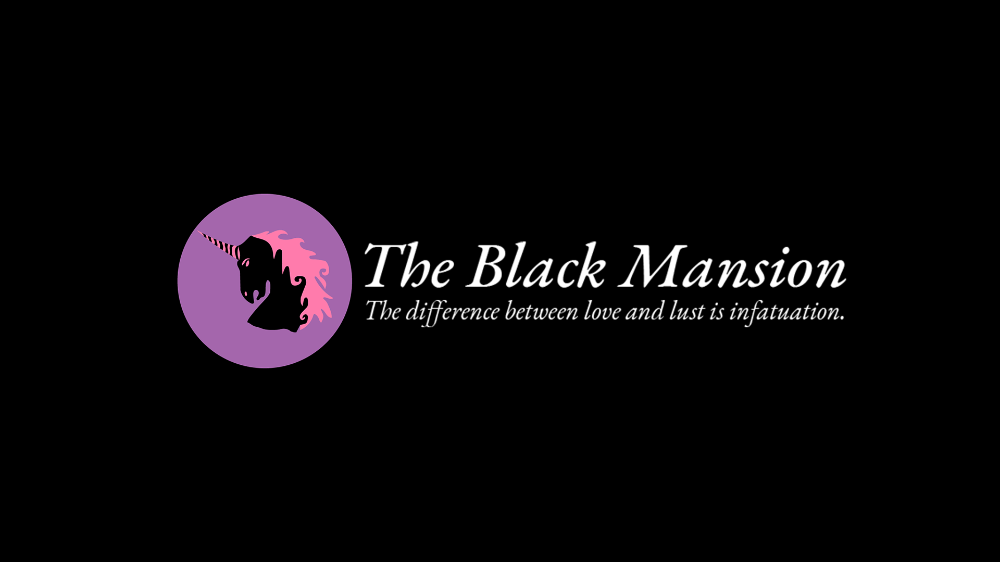

 

# THE BLACK MANSION :black_heart: :unicorn:

## About :books:

I haven't used Flutter and Dart in a while now and I recnetly rebuilt the API view of my blog [here](https://blckunicorn.art) and wanted to practice again and stay in shape, so I built a Flutter app to display all my posts in a neat little app for all platforms. This is that app. Enjoy. :heart:

## Download :inbox_tray:

- ***Angeldust*** (v.1.0.0):
  - ***[Download for Mac OSX](https://github.com/iamtheblackunicorn/TheBlackMansion/releases/download/v.1.0.0/TheBlackMansion-v1.0.0-Angeldust-Release.app.zip)***

## Building :hammer:

Make sure that you have the following programmes installed:

- Flutter SDK
- Dart SDK
- Android Studio
- Android SDK
- Java JDK
- Xcode
- Make
- Git

After you have installed these, follow these steps:

- 1.) Download the source.
- 2.) Change directory into the source directory.
- 3.) Run `flutter build macos`.
- 4.) Enjoy.

You have now generated a release build of *The Black Mansion* for Mac OSX.

## Changelog :black_nib:

### Version 1.0.0: ***Angeldust***

- upload to GitHub
- polishing of the logic
- minor fixes

## Note :scroll:

- *The Black Mansion :black_heart: :unicorn:* by Alexander Abraham :black_heart: a.k.a. *"The Black Unicorn" :unicorn:*
- Licensed under the MIT license.
